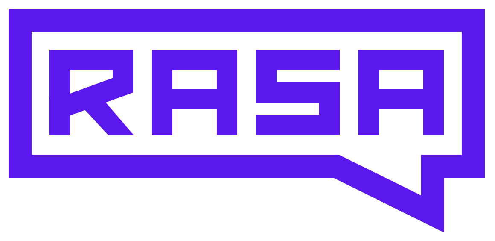

<div align="center">

<picture>
  <source media="(prefers-color-scheme: dark)" srcset="./.github/assets/rasa_logo_horizontal_white.png">
  
</picture>

# Rasa Quickstart

### A production-ready Rasa Pro (CALM) agent, in one command.

Bootstrap a fresh **[Rasa Pro](https://rasa.com/docs/learn/concepts/calm/)** assistant —
CALM scaffold, a trained model, and coding-agent skills wired into your editor —
with a single command. No cloning, no setup steps.

<br>

[](https://rasa.com/docs/)
[](https://rasa.com/docs/rasa-pro/developer-edition/)
[](https://learning.rasa.com/rasa-pro/)
[](https://discord.gg/vMgsuRQ7p)

</div>

---

## ⚡ Get started in ~60 seconds

**macOS / Linux**

```bash
curl -fsSL https://raw.githubusercontent.com/rasa-customers/rasa-quickstart/main/install.sh | bash
```

**Windows (PowerShell)**

```powershell
irm https://raw.githubusercontent.com/rasa-customers/rasa-quickstart/main/install.ps1 | iex
```

The bootstrap installs [`uv`](https://docs.astral.sh/uv/), downloads the project,
starts a fresh git repo, sets up a virtual environment, installs Rasa skills for
your coding agent, and trains an initial model. Then:

```bash
cd rasa-quickstart
# add RASA_LICENSE and your LLM key to .env, then:
make inspect
```

> New to Rasa? The [**Rasa Developer Edition**](https://rasa.com/docs/rasa-pro/developer-edition/)
> is **free** and runs locally on your laptop.

---

## 🎛️ Options

Pass a target directory and/or flags. On macOS/Linux, append them after `-s --`:

```bash
curl -fsSL https://raw.githubusercontent.com/rasa-customers/rasa-quickstart/main/install.sh \
  | bash -s -- --ides claude,cursor --provider openai my-agent
```

On Windows, run the downloaded script with arguments:

```powershell
& ([scriptblock]::Create((irm https://raw.githubusercontent.com/rasa-customers/rasa-quickstart/main/install.ps1))) `
  -Ides claude,cursor -Provider openai my-agent
```

| Flag | Values | Default |
|---|---|---|
| `--ides` | `claude`, `cursor`, `vscode`, `jetbrains` (comma-separated) | auto-detected, then prompted |
| `--provider` | `openai`, `anthropic` | `openai` |
| `--yes` | accept detected defaults, no prompts | off |
| `--skip-train` | skip the initial model training | off |
| *(positional)* | target directory to create | `rasa-quickstart` |

---

## 📦 What you'll get

The bootstrap delivers the project in [`template/`](template/):

```
config.yml          CALM pipeline + LLM model group
domain/             responses, slots, actions
data/flows/         conversation flows (business logic)
actions/            custom Python actions
endpoints.yml       action server, tracker store, model groups
credentials.yml     chat / voice channels
e2e_tests/          end-to-end conversation tests
Makefile            setup / run / inspect / train / ...
scripts/setup.py    one-shot provisioning
.env.example        secrets template (copy to .env)
```

See [`template/README.md`](template/README.md) for the day-to-day building guide.

---

## 🧰 What you'll need

- 🔑 A **free [Rasa Developer Edition license](https://rasa.com/docs/rasa-pro/developer-edition/)** → `RASA_LICENSE` in `.env`
- 🤖 An **OpenAI API key** (the default provider — Rasa supports other LLMs too) → `OPENAI_API_KEY` in `.env`
- ⚡ [**`uv`**](https://docs.astral.sh/uv/) — installed automatically by the bootstrap; it also handles the right Python version

---

## 🗂️ Already have the repo?

If you cloned this repo instead of using the bootstrap, the project lives in `template/`:

```bash
cd template
cp .env.example .env    # fill in RASA_LICENSE + your LLM key
make setup
make inspect
```

---

## 🏗️ Repository layout

This repo is a source/template — most of it never lands on your machine:

- **`template/`** — the delivered project. The bootstrap copies *only* this directory, then starts a fresh git history.
- **`install.sh` / `install.ps1`** — the bootstrap, served over HTTPS and run directly (never copied).
- **`tests/`, `.github/`, `scripts/maintenance/`** — CI and maintenance tooling for this repo, not part of your project.

**Contributing:** run the checks with
`uv run --with pytest --with ruamel.yaml python -m pytest tests/`.
The pinned Rasa version tracks the latest release over time; the committed scaffold in `template/` is kept in sync by automation.

---

<div align="center">

### Ready to build something real?

[](https://rasa.com/connect-with-rasa)
&nbsp;&nbsp;
[](https://rasa.com/docs/)

<sub>Built with ❤️ by the Rasa team · <a href="https://rasa.com/">rasa.com</a> · <a href="https://discord.gg/vMgsuRQ7p">Discord community</a></sub>

</div>
